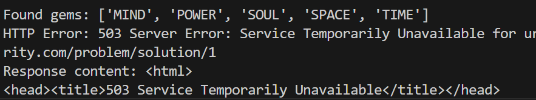

# Python_technical_test

This repository contains the solutions to a Python technical test.

---

## Exercise 1 - Gem Finder

This is the result of the first exercise, where we scan a matrix for hidden "Infinity Stones" (gems):

---

## Exercise 2 - SQL Queries

These are the SQL queries used in the second exercise:

### 1. Get Current Locations of Averages

SELECT l.name 
FROM average a
JOIN location l ON a.current_location_id = l.Id;

Exercise 2 - SQL Queries

These are the SQL queries used in the second exercise:

### 2. Get Locations with More Than 3 Logs per Average

SELECT l.name 
FROM average_location_log all
JOIN location l ON all.location_id = l.Id
GROUP BY all.average_id, l.name
HAVING COUNT(*) > 3;

### 3. Update Satellites to Maintenance Status

UPDATE start_satellite ss
SET in_maintenance = TRUE
WHERE ss.location_id IN (
    SELECT DISTINCT a.current_location_id 
    FROM average a
)
AND RAND() < 0.5;

---

## Exercise 3 - Fuel-Efficient Path to Ironman

This exercise involves calculating the most fuel-efficient route for a satellite to reach Ironman, considering dynamic weather penalties on each path.

Goals:
- Start from New York
- Find Ironman's location (e.g. "Berlin")
- Traverse via satellite links
- Minimize fuel consumption
- Ensure remaining fuel ≥ 30 units

Fuel Rules:
- Start Fuel: 100 units
- Base Consumption per Jump: 10 units
- Weather Penalties:
  * "Viento en contra" → +1.5
  * "Lluvia" → +0.2
  * "Tormenta" → +2.0

Solution Summary:
- Used Dijkstra's algorithm
- Evaluated weather impact
- Ensured mission success

Sample Output:
Ironman is in: Berlin
Calculated path: New York -> Washington -> Atlantic -> Madrid -> Barcelona -> Roma -> Paris -> Berlin
Remaining fuel: 34.3
Mission can succeed with enough fuel.